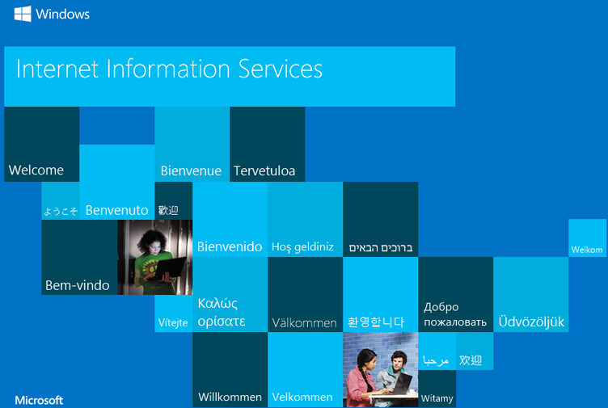
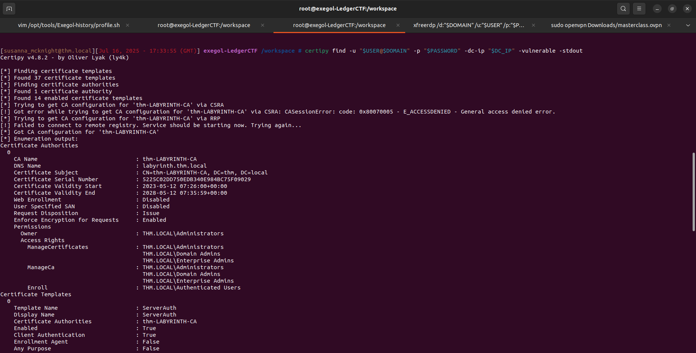
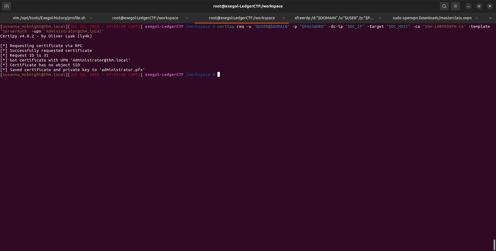

# 🧠 Write-up – *Ledger* | TryHackMe

**Catégorie :** Active Directory  
**Plateforme :** TryHackMe  
**Objectif :** La machine **Ledger** simule un environnement Active Directory dans lequel l’attaquant doit énumérer des utilisateurs via LDAP, exploiter des mots de passe par défaut pour obtenir un premier accès utilisateur, puis élever ses privilèges en abusant d’une mauvaise configuration d’Active Directory Certificate Services (ADCS). L’objectif final est d’obtenir un certificat permettant de s’authentifier comme **Administrator**.


---

## 1. Scan Nmap – Que nous réserve l'infrastructure ?

Avant de sauter sur les outils les plus sexy, on reste sobre : un bon vieux scan Nmap pour poser les fondations de notre compréhension.

```bash
nmap -sC -sV -Pn -T4 -p- <IP>
```

[](../images/Ledger/nmap_output.png)

### 📡 Ports ouverts – Analyse initiale

Voici les ports détectés par Nmap, avec une analyse rapide des opportunités potentielles :

| Port | Service     | Interprétation / Action                       |
|------|-------------|-----------------------------------------------|
| 53   | DNS         | 🔎 **Zone transfer** à tester                 |
| 80   | HTTP        | 🌐 **Investigation web** (site classique ?)   |
| 88   | Kerberos    | 🔓 **ASREPRoasting** si usernames connus     |
| 135  | RPC         | 📤 Enumération via **rpcdump**               |
| 139  | NetBIOS     | 📂 Enumération avec **smbmap**/**enum4linux**|
| 445  | SMB         | 📂 Possibles partages, droits, Enum SMB       |
| 389  | LDAP        | 🧬 **ldapsearch** pour extraire des comptes   |
| 443  | HTTPS       | 🌐 **Version sécurisée du site**, à fouiller |
| 3389 | RDP         | 🔐 **Accès distant** si compte valide         |

On fuite:
- Le Domain name --> `thm.local`
- Le FQDN  de la machine --> `labyrinth.thm.local`

## DNS – Peut-on aspirer des infos facilement ?

Un petit test de zone transfer, souvent négligé mais parfois très parlant :

[](../images/Ledger/dig.png)

❌ Échec.

Pas grave, on poursuit notre chasse aux infos ailleurs.

---

## 3. HTTP/HTTPS – Espoir sur le web ?

Direction le port 80 (HTTP) puis 443 (HTTPS). L’accès renvoie une page par défaut IIS.

[](../images/Ledger/IIS.png)

---

## 4. SMB/RPC – Partages juteux ?

[](../images/Ledger/enum4linux.png)

❌ Rien d’exploitable. On dirait qu’il faut être authentifié pour obtenir quelque chose. Revenons plus tard.

---

## 5. LDAP – La perle rare ?

[](../images/Ledger/ldapsearch.png)

[](../images/Ledger/ldapdump_description.png)

[](../images/Ledger/ldapdump_users.png)

💥 Bingo ! Deux utilisateurs apparaissent avec le même mot de passe par défaut:

    IVY_WILLIS

    SUSANNA_MCKNIGHT

---

## 6. RDP – Une ouverture vers le système ?

On teste la possibilité que les users trouvé précédemment puissent se connecter en RDP:

[](../images/Ledger/nxc_fail.png)

[](../images/Ledger/nxc_success.png)


Puis on se connecte avec le user qui peut établir une session RDP avec la machine

[](../images/Ledger/rdp.png)


On récupère le flag `user.txt`


---

## 7. PrivEsc – L’escalade par les certificats 🧩

On explore les groupes auxquels Susanna appartient et… oh :

[](../images/Ledger/groups.png)

Certificate Service DCOM Access

🧠 Réfléchis : Cela te donne-t-il un levier sur les services de certificats Windows ? Tu peux peut-être demander un certificat d’authentification machine...

Utilisation de Certipy, un outil redoutable pour cet univers :

[](../images/Ledger/certipy_find.png)

Un template vulnérable est découvert ! On tente alors :

[](../images/Ledger/certipy_req.png)

On obtient un certificat qui permet de s’authentifier comme Administrator 😈

[](../images/Ledger/certipy_auth.png)

Et voilà un TGT Administrator en poche. La clé du royaume.

---

## 8. Connexion Admin – La boucle est bouclée

Avec un TGT valide, un wmiexec.py de Impacket nous donne un shell direct en tant qu’admin :

[](../images/Ledger/root.txt.png)

Et le Graal nous attend !

---

## Conclusion

Ce challenge est un excellent exemple d’un scénario réaliste d'Active Directory :

    Reconnaissance passive (DNS, LDAP, Nmap)

    Exploitation de mauvaises pratiques (mots de passe par défaut)

    Escalade via ADCS (Active Directory Certificate Services)


