# **Reset**

**Catégorie :** Active Directory  
**Plateforme :** TryHackMe  
**Objectif :** Accéder à un compte Domain Admin sur une machine Windows en analysant l'infrastructure Active Directory, capturant des hash, identifiant les chemins d'attaque et exploitant les mauvaises configurations de délégation Kerberos.

---

### 1. Scan initial avec Nmap

Comme toujours, on commence par une cartographie de base. Quels services tournent sur cette machine ? Quels ports sont exposés ? On exécute un scan complet avec Nmap :

```bash
nmap -sC -sV -Pn -T4 -p- "$TARGET"
```

[](../images/Reset/nmap.png)

Quelques points à noter ici :

- Le port **53 (DNS)** est ouvert. Est-ce qu’un transfert de zone est possible ?  
- Le port **88 (Kerberos)** est accessible. Pourrait-il y avoir des utilisateurs vulnérables au **AS-REP Roasting** ?  
- Les ports **135 / 139 / 445 (RPC / SMB)** pourraient nous donner accès à des partages.  
- Le **RDP (3389)** et **WinRM (5985)** nécessitent des identifiants, mais deviennent très utiles une fois qu’on a un pied dans le domaine.

A noter que le scan nmap nous a permis de fuiter:
- le domain : `thm.corp`
- le FQDN de la machine: `HayStack.thm.corp`
---

#### 1.1 Exegol-history

`exegol-history` est un mécanisme ou module souvent utilisé dans l’environnement Exegol, un conteneur Docker offensif conçu pour les pentesters et Red Teamers. Il permet, entre autres, de personnaliser la session de travail dans le conteneur, notamment via le chargement de variables d’environnement dès l’ouverture d’un terminal Exegol.

L’intérêt principal est de pré-configurer automatiquement des variables sensibles ou utiles à chaque engagement, comme :

    TARGET : nom ou IP de la cible

    DOMAIN : domaine Active Directory attaqué

    USERNAME : compte compromis durant le pentest

    PASSWORD : mot de passe du compte associé

    ... 

[](../images/Reset/exegol_history.png)

Cela évite de devoir les retaper à chaque fois, permet de les utiliser dans des scripts ou des outils (NetExec, Impacket, etc.), et standardise l’environnement d’un opérateur à l’autre.

---

### 2. Transfert de zone DNS

Premier réflexe en présence de DNS : tester un **zone transfer**.

[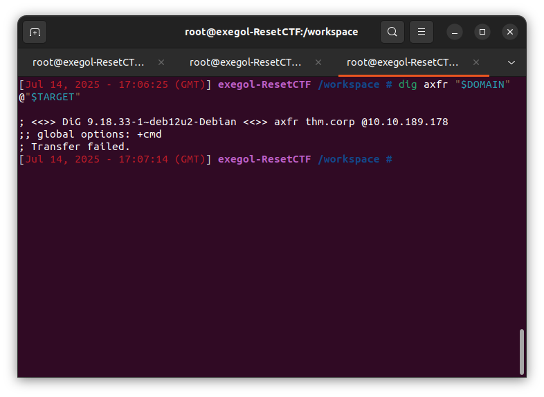](../images/Reset/dns_zone_transfer.png)

Malheureusement, l’opération échoue.


---

### 3. Énumération SMB

Passons aux ports SMB. On utilise **enum4linux** pour extraire un maximum d’informations sur le domaine et les partages.

[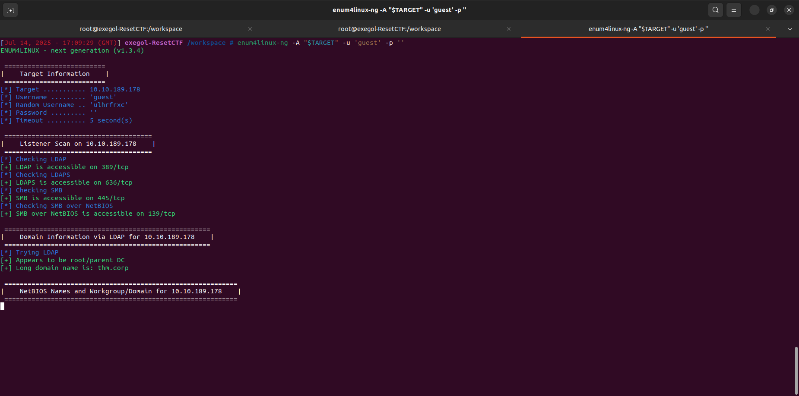](../images/Reset/enum4linux.png)
[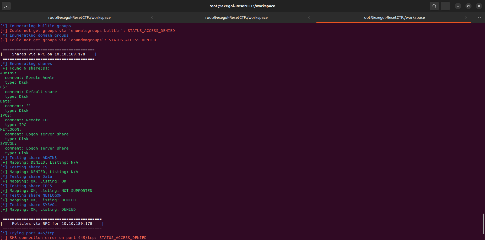](../images/Reset/shares_enum4linux.png)
Un partage nommé **Data** est accessible.  
On confirme la présence et les restrictions de ce partage ave smbmap
[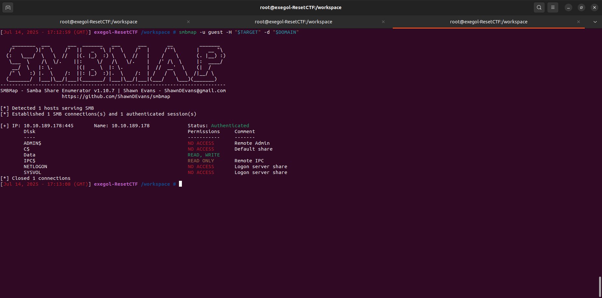](../images/Reset/smbmap.png)

Une connexion via `smbclient` permet de parcourir son contenu.

[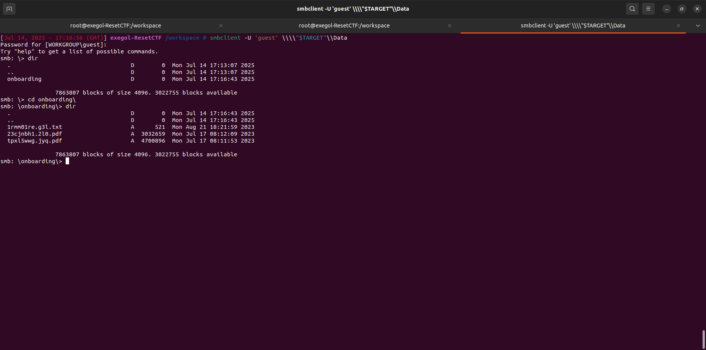](../images/Reset/smb_shares.png)

Chose étrange : les noms de fichiers changent régulièrement. Cela évoque un processus automatique en arrière-plan. Peut-être un **compte de service** ?

[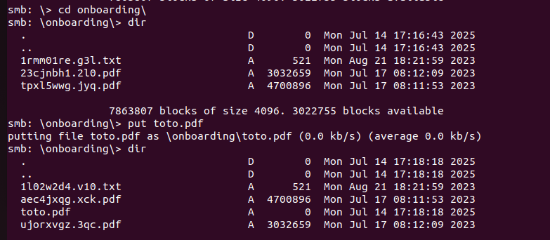](../images/Reset/changement_nom_fichiers.png)

Ce comportement mérite qu'on le provoque... et qu'on en profite.

---

### 4. Capture de hash NTLM via Responder

L’objectif ici est de capturer un **hash NTLM** via une attaque de type **SMB relay / capture**.

- On génère des fichiers piégés avec **ntlm_theft** (diverses extensions)

[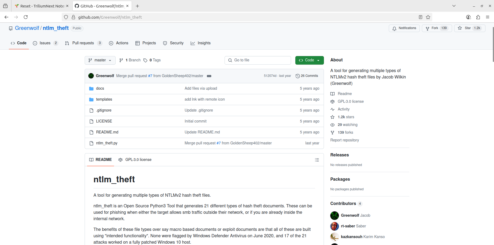](../images/Reset/ntlm_theft.png)
[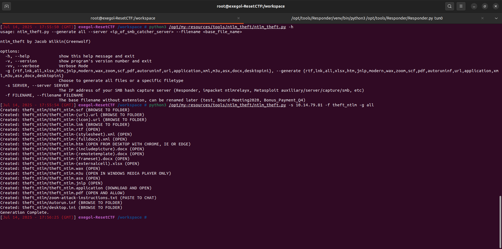](../images/Reset/genrate_file_ntlm_theft.png)

- On les upload dans le partage

[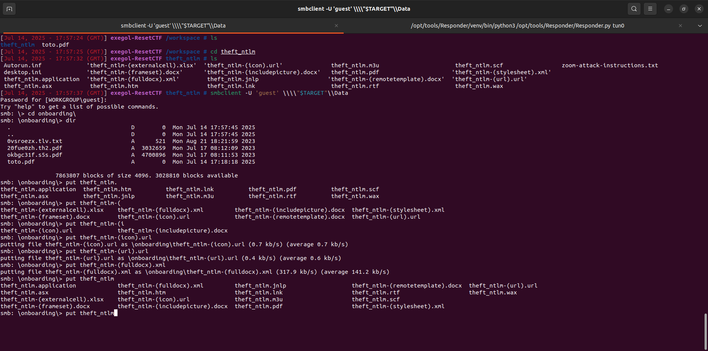](../images/Reset/upload_file.png) 

- On lance **Responder** en écoute

[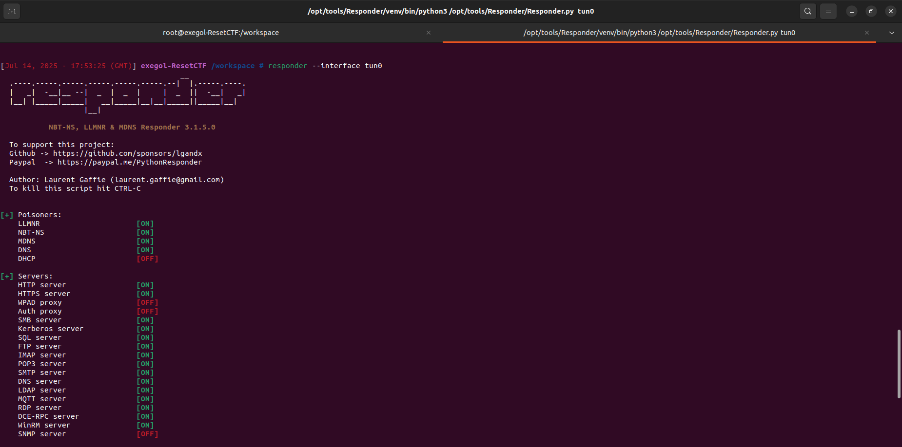](../images/Reset/responder.png) 

Quand un service (comme un compte automatisé) interagit avec ces fichiers, il envoie ses identifiants au format NTLM.

[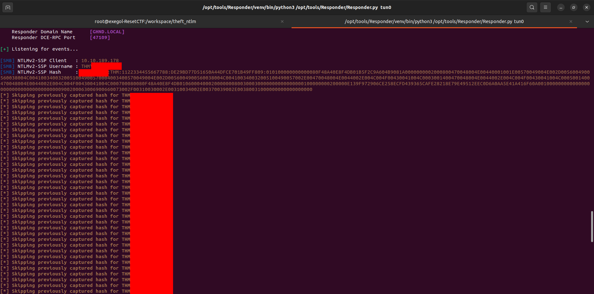](../images/Reset/get_nt_hash.png)

À ce stade, pose-toi la question : pourquoi ce service interagit-il avec mes fichiers ? Quel rôle joue-t-il dans l’environnement AD ?

---

### 5. Crackage du hash NTLM et accès initial

Une fois le hash récupéré, direction **John the Ripper** pour le bruteforce.

[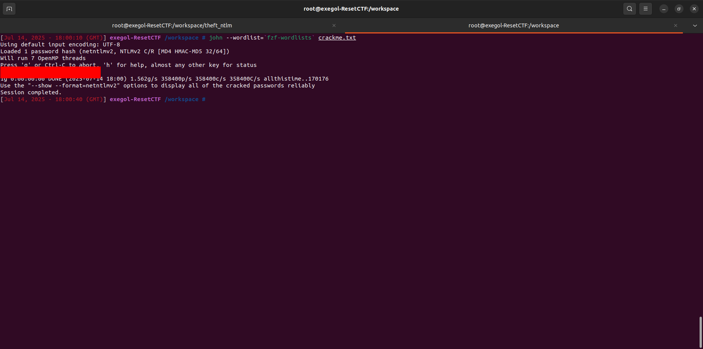](../images/Reset/crack_hash1.png)

Une fois le mot de passe découvert, une session **Evil-WinRM** permet de se connecter à la machine.

[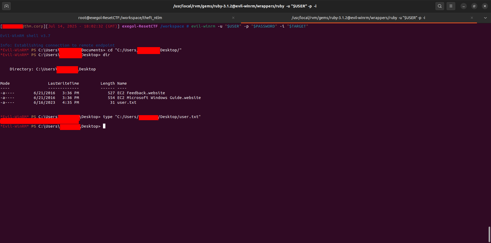](../images/Reset/evil-winRM_+_user_flag.png)

Premier drapeau : `user.txt`.  
Mais surtout, premier point d’ancrage dans l’environnement. Il est temps de lever la tête et d’observer l’infrastructure AD dans son ensemble.

---

### 6. Reconnaissance Active Directory avec BloodHound

Pour analyser l’environnement Active Directory, on utilise **BloodHound**.  
Cette étape est cruciale pour identifier les relations d’accès, les permissions implicites et les mauvaises configurations.

Les étapes :

- Lancer **Neo4j**

```bash
neo4j console
```

- Lancer le collecteur **BloodHound** de la suite Imapcket

[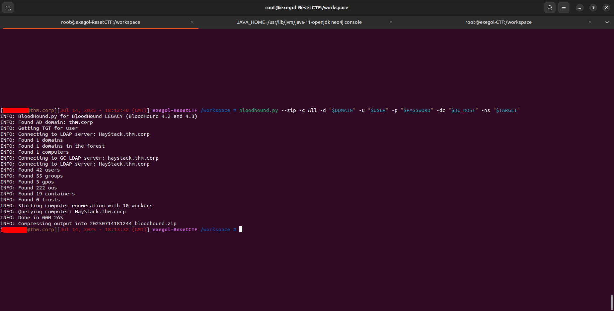 ](../images/Reset/bloodhound_collector.png) 

- Charger les données dans BloodHound et observer
  
[](../images/Reset/import_bloodhound.png)  

Questions à se poser ici :  
- Qui a accès à quoi ?  
- Quelles permissions sont abusables ?  
- Existe-t-il un chemin vers des privilèges plus élevés ?

---

### 7. Mouvement latéral via AS-REP Roasting

BloodHound permet d'identifier les comptes vulnérables à **AS-REP Roasting**.

[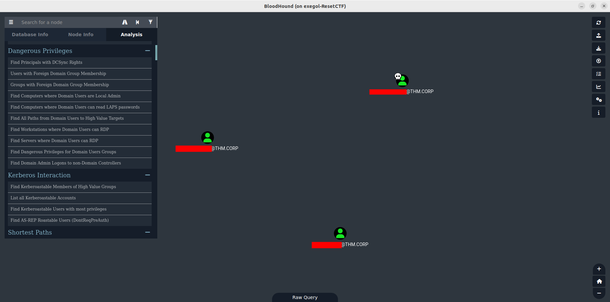](../images/Reset/AS-REProast_users.png)

On repère **trois utilisateurs** qui n’ont pas la pré-authentification activée. C’est une opportunité à ne pas rater.

On récupère les tickets TGT chiffrés, puis on les soumet à John the Ripper.

[](../images/Reset/Get-NPUsers.png)


[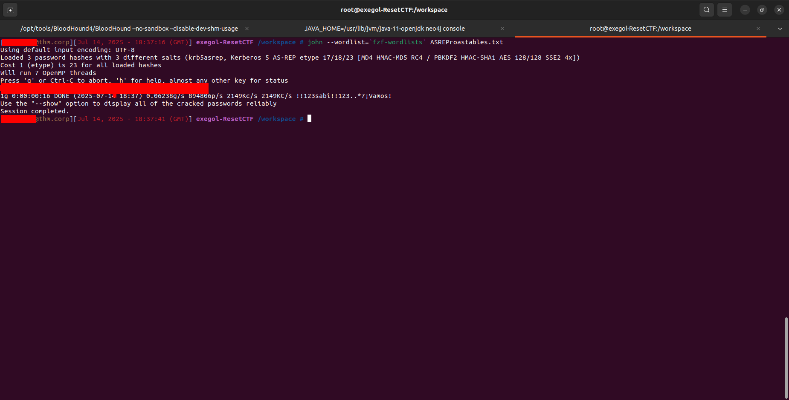](../images/Reset/crack_hash2.png)

Un mot de passe tombe.

**Réfléchis :** Pourquoi ces comptes n’ont-ils pas de pré-authentification ? Est-ce une négligence ou une configuration volontaire ?

---

### 8. Abus de privilèges via Reset Password

En analysant plus profondément avec BloodHound, on découvre que l'utilisateur dont on vient de cracker le mot de passe a le droit de réinitialiser le mot de passe d'un compte qui a son toura le droit de réinitialiser le mot de passe d'un compte, etc.

[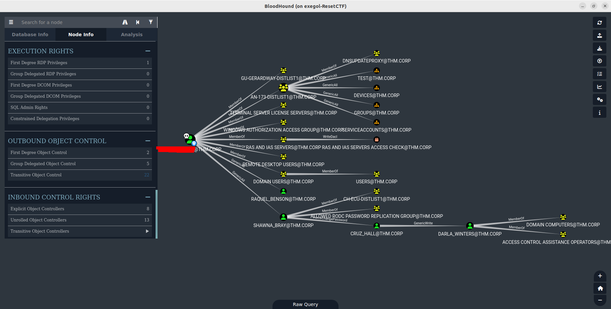](../images/Reset/kill_chain.png)

C’est une chaîne d’escalade :  
1. Réinitialiser le mot de passe d’un premier compte  
2. S’en servir pour en compromettre un autre  
3. Répéter jusqu’à tomber sur un compte intéressant

---

### 9. Délégation Kerberos (contrainte)

Le dernier compte obtenu possède des droits de délégation **AllowedToDelegateTo**.  
C’est ce qu’on appelle de la **délégation Kerberos contrainte**, et c’est particulièrement dangereux si mal configuré.

[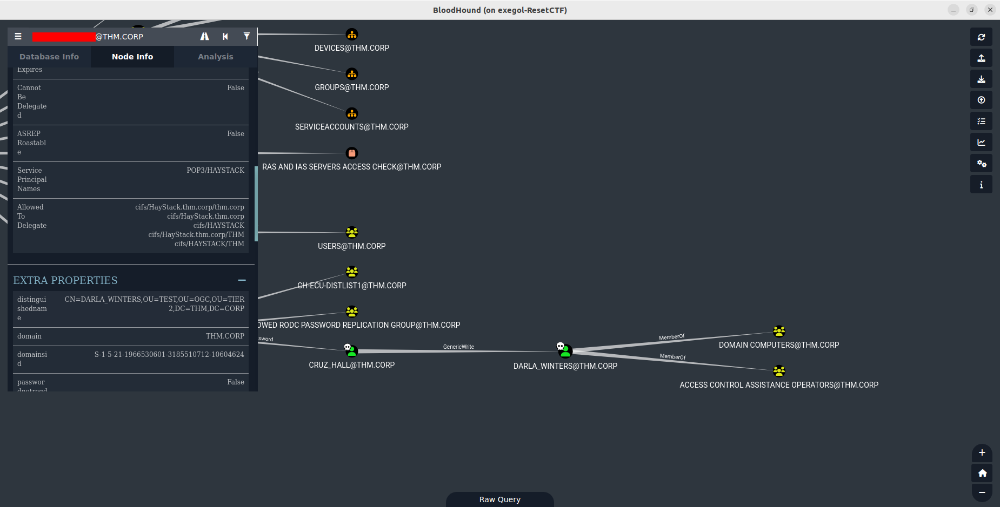](../images/Reset/kerberos_delegations.png)

Avec ces droits, il est possible de forger un **Service Ticket** pour le service `cifs` au nom de **Administrator**.

[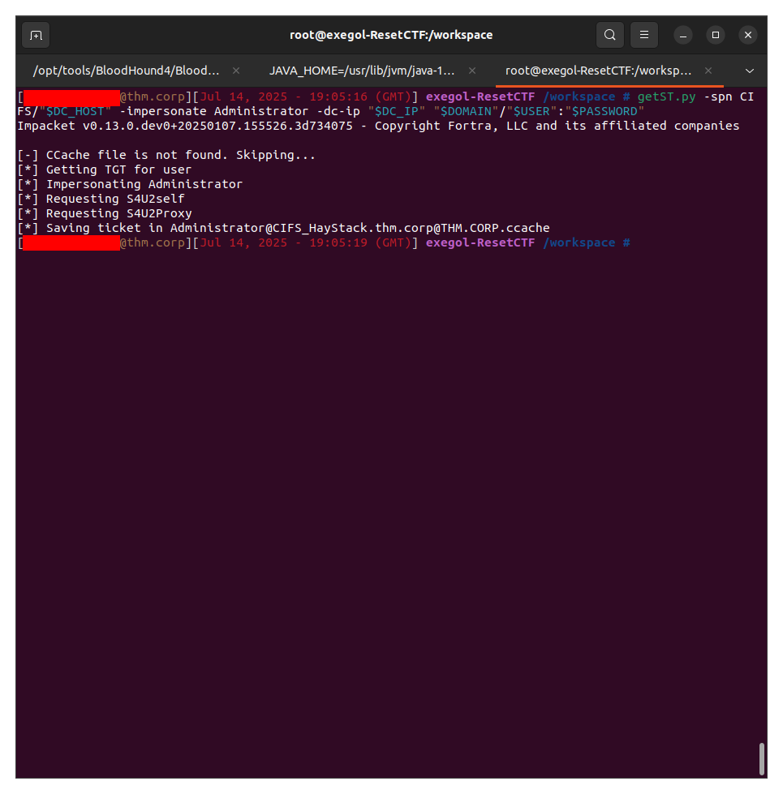](../images/Reset/getST.png)

---

### 10. Accès au compte Administrator

Le ST est forgé et exporté comme variable d’environnement.

Il ne reste plus qu’à se connecter avec **wmiexec.py** ou un équivalent.

[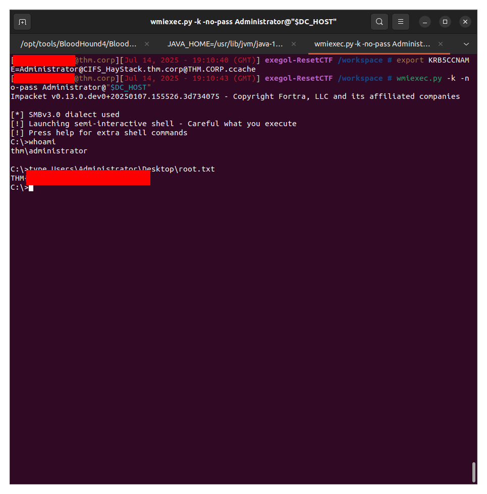](../images/Reset/root.txt.png)

On accède à la machine avec les droits **Domain Admin**.  
Et on récupère le flag final : `root.txt`.

---

🎯 **Réflexion finale :**  
Cette machine montre bien comment **plusieurs petites faiblesses combinées** (AS-REP Roasting, permissions mal maîtrisées, délégation Kerberos) peuvent conduire à une compromission complète du domaine.

Chaque étape n’est pas forcément critique seule, mais ensemble, elles ouvrent un chemin vers l’escalade maximale.
